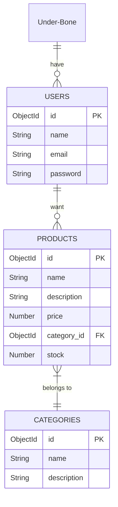

# Aplicacion de Gestión de Under Bone (Clon de Under Armour)

### Descripción del sistema

Esta es una aplicación web diseñada para gestionar los productos de una tienda clon de Under Armour. La aplicación permite a los usuarios realizar operaciones CRUD (Crear, Leer, Actualizar y Eliminar) en productos y categorías, así como gestionar usuarios y sus permisos de autenticación. La aplicación está desarrollada utilizando la pila MERN (MongoDB, Express, React y Node.js) para ofrecer una experiencia rápida, eficiente y moderna.

### Funcionalidades

- **Agregar**: Creación de productos y categorias por medio de un formulario

- **Gestión de Productos**: Edición, eliminación y listado de productos

- **Gestión de Categoría**: Edición, eliminación y listado de categorías

- **Registro de Usuario**: Creación de usuario por medio de un formulario

- **Inicio de Sesion**: Inicio de Sesion para gestionar productos y categorias

- **Diseño Responsive**: Interfaz amigable a dispositivos móviles y de escritorios

### Tecnologías Usadas

- **Frontend**: Desarrollo en **React.js** con **Javascript** y estilos con **CSS**

- **Backend**: Desarrolló en **Node.js** con **Express**

- **Base de datos** **MongoDB** para almacenar información del proyecto.

- **Control de código**: Uso de **GitHub** para la gestión del proyecto

### Requisitos

- [Node.js](https://nodejs.org/) - Entorno de ejecución de Javascript

- [MongoDB](https://www.mongodb.com/) - Base de datos NoSQL

- [Postman](https://www.postman.com/) - Herramienta para probar el funcionamiento los endpoints <Opcional>

## Diagrama de la base de datos



### Instalación y Configuración

1. Clona el repositorio:

```bash

git  clone  https://github.com/unknown6498/Under-Bone--Clon-de-Under-Armour-.git

```

2. Instalar las dependencias necearías tanto en la carpeta del Backend y Frontend en el siguiente comando

```bash
npm  install
```

3. Crea un archivo .env tanto en la carpeta Backend y Frontend añade las siguientes variables

=> Backend

```bash

PORT  =  <5000 o Puerto de preferencia>

MONGO_URI  =  <Base de Datos de MongoDB Atlas o MongoDB Compass>

JWT_SECRET = <Tu clave segura>

```

=> Frontend

```bash

VITE_REACT_API_URL=http://localhost:5000/

```

## Ejecución

1. Inicia el servidor en la carpeta Backend:

```bash
cd backend
npm run dev
```

2. Inicia la interfaz del proyecto en la carpeta Frontend:

```bash

cd frontend
npm run dev

```

## Endpoints del Backend

Rutas para Productos

    POST /api/productos/ - <Crear un nuevo producto.>

    GET /api/productos/ - <Obtener todos los productos.>

    PUT /api/productos/:id - <Actualizar un producto específico por su ID.>

    DELETE /api/productos/:id - <Eliminar un producto específico por su ID.>

Rutas para Categories

    POST /api/categorias/ - <Crear una nueva categoría.>

    GET /api/categorias/ - <Obtener todas las categorías.>

    PUT /api/categorias/:id - <Actualizar una categoría específica por su ID.>

    DELETE /api/categorias/:id - <Eliminar una categoría específica por su ID.>

Rutas para Usuarios

    POST /api/usuarios/registro - <Registrar un nuevo usuario.>

    POST /api/usuarios/iniciarsesion - <Inicio de sesion del usuario>

    GET /api/usuarios/ - <Obtener todos los usuarios.>

    PUT /api/usuarios/:id - <Actualizar un usuario específico por su ID.>

    DELETE /api/usuarios/:id - <Eliminar un usuario específico por su ID.>

## Evidencias de Funcionamiento


